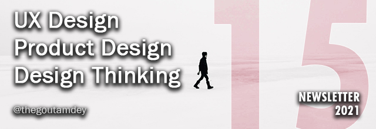

# UXTW - Week 15, 2021

## Articles of the week

[**UX Research for Brand Colour?**](https://thistooshallgrow.com/blog/ux-research-brand-colour/)\
Among the selected hypotheses, what is the best option to use as the primary colour?

[**Unicorns, Foxes, Hedgehogs, the UX Design Bestiary**](https://www.interaction-design.org/literature/article/unicorns-foxes-hedgehogs-the-ux-design-bestiary)\
It’s useful to know what each of these terms means because it allows us to talk in a common language — and who knows?.

[**Refine, Remodel, Rebuild: 3 Strategies for Experience Improvement**](https://www.nngroup.com/articles/refine-remodel/)\
To improve customer experience, organizations can choose solutions ranging from low to high investment and impact, depending on their current state, budget, risk tolerance, transformation readiness, and unmet needs.

[**UXTW**](https://gmail.us17.list-manage.com/subscribe?u=1b23fd286b43ac36e4acba123\&id=0009036f95)\
Subscribe to _**UX This Week newsletter**_  to get weekly email full of curated articles and products on every thing UX, Product Design and Design thinking.

[**Over-complicated? Over-simplified? The UX Efficient Frontier**](https://uxdesign.cc/over-complicated-over-simplified-the-ux-efficient-frontier-561d7773bc6b/)** **\
Wow there’s too much information, I’m pushing for a major redesign — I would never be able to use this.

[**User-Centered Design and Design Thinking: Different Origins, similar practices**](https://measuringu.com/ucd-and-design-thinking/)\
User-Centered Design and Design Thinking are methods used to produce initial designs, after which they typically use iteration to improve the design. Here’s more on these two methodologies, which have different origins but share similar practices.

## Products of the week

[**Upvoty **](https://www.upvoty.com/?ref=thegoutamdey)\
Turn user feedback into actionable product optimizations!

[**Hellonext**](https://hellonext.co/?ref=thegoutamdey)\
Hellonext bridges the gap between your day-to-day development activity and customer feedback.

[**UXTW**](https://gmail.us17.list-manage.com/subscribe?u=1b23fd286b43ac36e4acba123\&id=0009036f95)\
Subscribe to _**UX This Week newsletter**_  to get weekly email full of curated articles and products on every thing UX, Product Design and Design thinking.

[**Nolt**](https://nolt.io/?ref=thegoutamdey)\
Nolt is a beautiful, collaborative place for all your user requests – no more outdated spreadsheets or chaotic Trello boards. Give your customers a voice and gain priceless insights.
