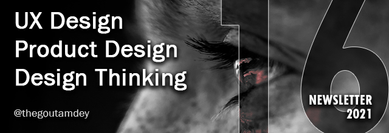

# UXTW - Week 16, 2021

## Articles of the week

****[**Iterations — the secret to great results**](https://thistooshallgrow.com/blog/ux-research-brand-colour/)\
Iterating is a phenomenal technique. It takes next to nothing to learn and benefits from all other experience and knowledge that you gain. Everybody knows it — few use it.

[**Behavioral Science Can Help to Create the Right Mental Model for your Users**](https://www.uxbooth.com/articles/behavioral-science-can-help-to-create-the-right-mental-model-for-your-users/?ref=thegoutamdey)\
For example, we have a mental model of money. It’s often: “I work to get money, so I can spend it on basic needs and wants.”&#x20;

[**Design Docs at Google**](https://www.industrialempathy.com/posts/design-docs-at-google/?ref=thegoutamdey)\
Design docs are informal documents and thus don’t follow a strict guideline for their content. Rule #1 is: Write them in whatever form makes the most sense for the particular project.

[**The ‘what’ and ‘why’ of design debt**](https://uxdesign.cc/the-what-and-why-of-design-debt-861be8b887fe/?ref=thegoutamdey)****[** **](https://uxdesign.cc/the-what-and-why-of-design-debt-861be8b887fe/?ref=thegoutamdey)\
New notifications don’t fit in the current structure. Even if they were, they would get lost in this noise..

[**Closing the Experience Gap**](https://airbnb.design/closing-the-experience-gap/)\
The Anti-discrimination team is dedicated to uncovering biases on our platform and making changes to help prevent and address discrimination.&#x20;

[**UXTW**](https://gmail.us17.list-manage.com/subscribe?u=1b23fd286b43ac36e4acba123\&id=0009036f95)\
Subscribe to _**UX This Week newsletter**_  to get weekly email full of curated articles and products on every thing UX, Product Design and Design thinking.

## Products of the week

[**Notionlytics**](https://notionlytics.com/?ref=thegoutamdey)\
Start collecting insights about your audience in seconds.

[**Plasmic**](https://www.plasmic.app)\
The visual builder and web design tool that works seamlessly with your codebase. Unblock your team, and empower anyone to ship.

[**UIHUT**](https://www.uihut.com)\
Download thousands of templates, illustrations, icons, and graphic assets for web and mobile app design without paying designer prices.

[**UXTW**](https://gmail.us17.list-manage.com/subscribe?u=1b23fd286b43ac36e4acba123\&id=0009036f95)\
Subscribe to UX This Week newsletter  to get weekly email full of curated articles and products on every thing UX, Product Design and Design thinking.
