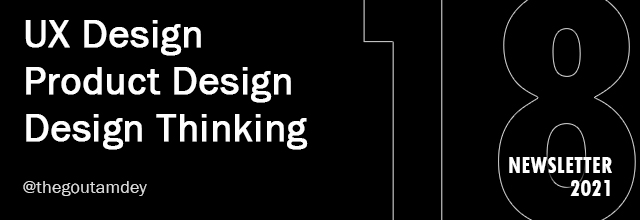

# UXTW - Week 18, 2021

## Articles of the week

[**5Es of usability**](https://www.wqusability.com/articles/getting-started.html/)\
Once we have defined the problem, the best approach to solving this problem often becomes obvious. To answer these questions, we need to understand how usability is defined for this product and the people who use it.

[**Important skill you need to fix usability**](https://uxdesign.cc/heres-the-most-important-skill-you-need-to-fix-usability-43abe5fd1dea/?ref=thegoutamdey)\
The most important if you want to solve usability problems. And that is common sense.\
&#x20;

[**Operational efficiency and operational efficacy: defining DesignOps’ metrics**](https://uxdesign.cc/operational-efficiency-and-operational-efficacy-defining-designops-metrics-b5a2c8fe40b7/?ref=thegoutamdey)\
As an efficiency-focused transformational function, DesignOps needs to be able to quantify and measure impact and results. Identifying the right goals and defining the right KPIs are therefore essential steps for every DesignOps strategy and roadmap to ensure impact and progress can be objectively assessed.\
&#x20;

[**Using the 30–60–90 Framework for Design Critique**](https://medium.com/swlh/using-the-30-60-90-framework-for-design-critique-960b68026b6f/?ref=thegoutamdey)****[** **](https://uxdesign.cc/the-what-and-why-of-design-debt-861be8b887fe/?ref=thegoutamdey)\
What is design critique? Why do it? What is involved? How do I give you feedback? What’s this 30–60–90 thing?.\
&#x20;

****[**Journey Mapping for Remote Teams: A Digital Template**](https://www.nngroup.com/articles/journey-map-digital-template/?ref=thegoutamdey)\
A collaborative spreadsheet is an efficient, effective tool for virtual customer-journey mapping. Because of the format and structure it affords, almost everyone will be able to access and easily use it..&#x20;

[**UXTW**](https://gmail.us17.list-manage.com/subscribe?u=1b23fd286b43ac36e4acba123\&id=0009036f95)\
Subscribe to _**UX This Week newsletter**_  to get weekly email full of curated articles and products on every thing UX, Product Design and Design thinking.

## Products of the week

[**Observable**](https://observablehq.com/?ref=thegoutamdey)\
Explore, visualize, and analyze data. Collaborate with the community. Learn and be inspired. Share insights with the world.

[**Mantine**](https://mantine.dev/?ref=thegoutamdey)\
Mantine is a MIT licensed open source react components and hooks library with focus on usability, accessibility and developer experience..

[**Classic UX books from the 1980s**](https://uxdesign.cc/classic-ux-book-from-the-1980s-ed4151a166ab/?ref=thegoutamdey)\
This compilation revisits the best books from one decade, the 1980s.

[**UXTW**](https://gmail.us17.list-manage.com/subscribe?u=1b23fd286b43ac36e4acba123\&id=0009036f95)\
Subscribe to _**UX This Week newsletter**_  to get weekly email full of curated articles and products on every thing UX, Product Design and Design thinking.

