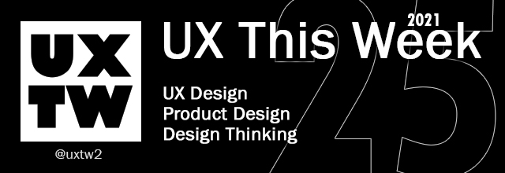

# UXTW - Week 25, 2021

## Articles of the week

****[**Capturing UX project requirements**](https://blog.prototypr.io/how-to-capture-ux-project-requirements-e1ba9b5174bb/?ref=uxthisweek)\
Requirements are about answering as many questions as you can, and writing those answers down in such a way that they are actionable and trackable.

****[**The benefits of applying an experience-driven mindset**](https://www.redhat.com/en/blog/stronger-ux-and-beyond-benefits-applying-experience-driven-mindset?term=26211/?ref=uxthisweek) **at Red Hat**\
****In a UXD context, this means putting our users first throughout our design process from ideation to final implementation.&#x20;

[**The evolution of UX challenges**](https://uxdesign.cc/the-evolution-of-ux-challenges-5e1748b82ede/?ref=uxthisweek)\
UX design is not a one-man show. We have to work closely with fellow designers, engineers, researchers, managers, business stakeholders, and clients. And while our ultimate goal is to make our users happy, in many cases the hardest part is that we have to make compromises.

****[**Collaborative flowcharting: What it is**](https://www.invisionapp.com/inside-design/collaborative-flowcharting/?itm\_campaign=default\&itm\_source=homefeatured\&itm\_medium=website\&itm\_content=default)\
The flowchart has been around since 1921, when Frank Gilberth, introduced the first flowchart to graphically represent a process. His chart aimed to improve efficiencies, particularly for a business’s production, accounting, and finance, and used a set of shapes to show specific actions. Gilbirth’s approach became a widely accepted practice for clearly mapping data flow and operations in early computer programming.

****[**UX Strategy: How To Research & Create One Effectively**](https://www.uxpin.com/studio/ux-design/the-11-minute-guide-to-bulletproof-ux-strategy/?ref=uxthisweek)\
A UX strategy should lay out the ideal user interaction with every aspect of a digital product. It should also prioritize what steps are needed to execute the strategy..

[**UXTW**](https://gmail.us17.list-manage.com/subscribe?u=1b23fd286b43ac36e4acba123\&id=0009036f95)\
Subscribe to _**UX This Week newsletter**_ to get weekly email full of curated articles and products on every thing UX, Product Design and Design thinking.

## Products of the week

****[**WinUI**](https://microsoft.github.io/microsoft-ui-xaml/?ref=uxthisweek)\
WinUI makes it easy to build modern, seamless UIs that feel natural to use on every Windows device. It embodies Fluent Design to enable intuitive, accessible, and powerful experiences and the latest user interface patterns.

[**PWAbuilder**](https://www.pwabuilder.com/?ref=uxthisweek)\
Ship your PWA to the app stores at lightning speed. PWAs are moving forward fast, learn about new web APIs, store readiness, and more!

****[**WebView2**](https://developer.microsoft.com/en-us/microsoft-edge/webview2/?ref=uxthisweek)\
Embed web content (HTML, CSS, and JavaScript) in your native applications with Microsoft Edge WebView2.

[**UXTW**](https://gmail.us17.list-manage.com/subscribe?u=1b23fd286b43ac36e4acba123\&id=0009036f95)\
Subscribe to UX This Week newsletter to get weekly email full of curated articles and products on every thing UX, Product Design and Design thinking.
