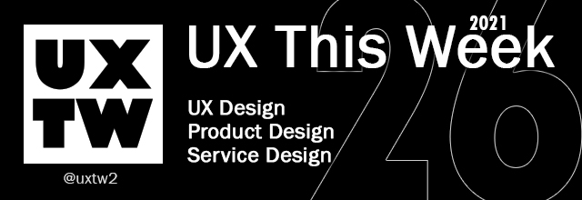

# UXTW - Week 26, 2021

## Articles of the week

****[**Emotion-Focused Toplines**](https://medium.com/emotion-centered-design/emotion-focused-toplines-2d5f10a1c324/?ref=uxthisweek)\
It is an artifact that helps the people you work with see the successes, challenges, opportunities, and pressing considerations from both a logistical and compassionate lens.

****[**Happy to Help: How We Design for Customer Support**](https://spotify.design/article/happy-to-help-how-we-design-for-customer-support/?ref=uxthisweek)****\
****Sometimes things are not working, not clear, or not built to address a wide-enough variety of needs. That’s why our Support team exists — to make sure people can get the help they need, when they need it..&#x20;

****[**Is Zombie Scrolling Syndrome Zapping Your Child’s Health?**](https://www.mcafee.com/blogs/consumer/family-safety/zombie-scrolling-syndrome-zapping-childs-health/?ref=uxthisweek)\
&#x20;If your child has a constant yawn, exceptional moodiness, and unusual stress (or even apathy) toward his or her school load, it’s possible he or she may have _Zombie Scrolling Syndrome (ZSS)_. Yes, we coined that term for chronic late-night phone scrollers, but it’s more than legit.

****[**Designing Friction For A Better User Experience**](https://www.smashingmagazine.com/2018/01/friction-ux-design-tool/?ref=uxthisweek)\
In experience design, friction is usually the opposite of being intuitive or effortless. However, that doesn’t mean that it’s always bad for the users. In this article, you’ll learn when and how friction can be an efficient tool to actually design better experiences.

****[**The fallacy of easy**](https://uxdesign.cc/the-fallacy-of-easy-a89ef864759b/?ref=uxthisweek)\
What if Facebook required everyone to open links before they share them?\
What if users were only able to share one external link per day?

[**UXTW**](https://gmail.us17.list-manage.com/subscribe?u=1b23fd286b43ac36e4acba123\&id=0009036f95)\
Subscribe to _**UX This Week newsletter**_ to get weekly email full of curated articles and products on every thing UX, Product Design and Design thinking.

## Products of the week

****[**Spotify Design's Remote Design Sprint Template**](https://www.figma.com/community/file/961940615273396965/?ref=uxthisweek)\
You don’t have to start from scratch, here’s a Spotify Design Figma file modified into a template for any distributed team to use for their next remote design sprint.

****[**Blacklight**](https://themarkup.org/blacklight/?ref=uxthisweek)\
Who is peeking over your shoulder while you work, watch videos, learn, explore, and shop on the internet? Enter the address of any website, and Blacklight will scan it and reveal the specific user-tracking technologies on the site—and who’s getting your data. You may be surprised at what you learn.

****[**A scorecard for creating human-centered, anxiety-free solutions**](https://caseorganic.medium.com/is-your-product-designed-to-be-calm-cdde5039cca5/?ref=uxthisweek)\
Making a good product is an important responsibility, especially if the product is close enough to someone that it can be the difference between life and death.

[**UXTW**](https://gmail.us17.list-manage.com/subscribe?u=1b23fd286b43ac36e4acba123\&id=0009036f95)\
Subscribe to UX This Week newsletter to get weekly email full of curated articles and products on every thing UX, Product Design and Design thinking.
