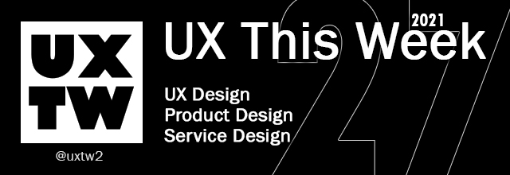

# UXTW - Week 27, 2021

## Articles of the week

[**Problems versus dilemmas: The complex trade-offs produced by social settings**](https://design.facebook.com/stories/problems-versus-dilemmas-the-complex-trade-offs-produced-by-social-settings/?ref=uxthisweek)  
People experiencing impaired hearing do not benefit from audio in our video products. Thankfully, there’s a discrete solution: captioning.

\*\*\*\*[**3 practical cheat sheets for designing attention grabbing UIs**](https://uxdesign.cc/3-practical-cheat-sheets-for-designing-attention-grabbing-uis-318e588bd864/?ref=uxthisweek)  
****To be able to design attention-grabbing products, firstly we need to understand where and when we have the biggest chance to hook the users. 

\*\*\*\*[**Thoughts on Skeuomorphic Menu Systems**](https://medium.com/@charliedeets/thoughts-on-skeuomorphic-menu-systems-9f02b1dd173f)  
The reliance on physical space for these transactions adds a realism to the idea that the player acquired something.

\*\*\*\*[**Designing Ad Experiences**](https://spotify.design/article/designing-ad-experiences)  
Are we providing enough transparency about the promotions our users receive? What would make this experience more engaging, relevant, and in tune with user intent?.

\*\*\*\*[**Absolutely FAB**](https://design.google/library/floating-action-button/)  
So much of Material Design was driven by the idea of making our UIs easier to navigate for users,” says Design Lead Bethany Fong, who worked on Material’s interaction design for smaller components: anything clickable or touchable that helped with a function on the screen.


Join us on Social Platforms.   
[**Twitter**](https://twitter.com/uxtw2) **\|** [**Facebook**](https://www.facebook.com/webusabilityandux) **\|** [**Linkedin**](https://www.linkedin.com/groups/1875717/) **\|** [**Slack**](https://join.slack.com/t/uxthisweek/shared_invite/zt-szpdweo1-d78hso8FppFcI68Xue_9Yw) **\| Newsletter**


## Products of the week

\*\*\*\*[**GlassUI Generator**](https://ui.glass/generator/?ref=uxthisweek)  
Get started with this free CSS generator based on the glassmorphism design specifications to quickly design and customize the style properties.

\*\*\*\*[**Undesign**](https://undesign.learn.uno/?ref=uxthisweek)  
Collection of free design tools and resources for makers, developers and designers.

\*\*\*\*[**DesignerHunt**](https://www.designerhunt.io/?ref=uxthisweek)  
A place to follow & learn from awesome designers, connect friends, hunt hire freelancers for your projects.


Join us on Social Platforms.  
[**Twitter**](https://twitter.com/uxtw2) **\|** [**Facebook**](https://www.facebook.com/webusabilityandux) **\|** [**Linkedin**](https://www.linkedin.com/groups/1875717/) **\|** [**Slack**](https://join.slack.com/t/uxthisweek/shared_invite/zt-szpdweo1-d78hso8FppFcI68Xue_9Yw) **\|** [**Newsletter**](https://gmail.us17.list-manage.com/subscribe?u=1b23fd286b43ac36e4acba123&id=0009036f95)


