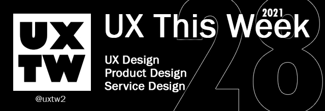

# UXTW - Week 28, 2021

## Articles of the week

****[**Why you should work at a non-design driven company**](https://vanschneider.com/blog/why-you-should-work-at-a-non-design-company/)\
Most designers I know, in particular those in their early career, want to work for a company already known for design.

****[**Creating Usability with Motion: The UX in Motion Manifesto**](https://medium.com/ux-in-motion/creating-usability-with-motion-the-ux-in-motion-manifesto-a87a4584ddc)****\
****The 12 Principles of UX in Motion,’ and they can be stacked and combined synergistically in a myriad of innovative ways.&#x20;

****[**A brief history of interaction design**](https://uxdesign.cc/where-did-this-interaction-come-from-a-brief-history-of-interaction-design-ebcc8c278ae7)\
In a dynamic system, the output changes with time if the system is not in a state of equilibrium..

****[**Growing a Distributed Product Design Team**](https://medium.com/spotify-design/growing-a-distributed-product-design-team-3563659ee2e6)\
How do we achieve our original goal of creating a highly collaborative and efficient product design team while everyone is remote?.

****[**Leadership without management**](https://www.intercom.com/blog/product-design-ic-career-path/?ref=uxthisweek)\
Many designers become managers for the wrong reasons. Often, they’re incentivized by their companies to become managers to gain greater impact, influence, and compensation.


Join us on Social Platforms. \
[**Twitter**](https://twitter.com/uxtw2)** | **[**Facebook**](https://www.facebook.com/webusabilityandux)** | **[**Linkedin**](https://www.linkedin.com/groups/1875717/)** | **[**Slack**](https://join.slack.com/t/uxthisweek/shared\_invite/zt-szpdweo1-d78hso8FppFcI68Xue\_9Yw)** | Newsletter**


## Products of the week

****[**Spaceli**](https://spaceli.io/?ref=uxthisweek)\
Turn Google Docs into a knowledge base. Organize Google Docs in a way where people can find them..

****[**UXProof**](https://uxproof.standuply.com/?ref=uxthisweek)\
Gather experts' feedback on your design prototype.

****[**TypeDream**](https://typedream.com/?ref=uxthisweek)\
Typedream helps you build a beautiful website using a simple interface.


Join us on Social Platforms.\
[**Twitter**](https://twitter.com/uxtw2)** | **[**Facebook**](https://www.facebook.com/webusabilityandux)** | **[**Linkedin**](https://www.linkedin.com/groups/1875717/)** | **[**Slack**](https://join.slack.com/t/uxthisweek/shared\_invite/zt-szpdweo1-d78hso8FppFcI68Xue\_9Yw)** | **[**Newsletter**](https://gmail.us17.list-manage.com/subscribe?u=1b23fd286b43ac36e4acba123\&id=0009036f95)

