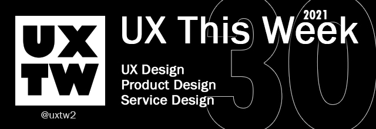

# UXTW - Week 30, 2021

## Articles of the week

****[**The best (free) resources for new UX/UI designers**](https://uxdesign.cc/the-best-free-resources-for-new-ux-ui-designers-39d73ce18bfb/?ref=uxthisweek)\
Content whose main purpose is to attract attention and encourage visitors to click on a link to a particular web page.

****[**UX migration strategy for legacy applications**](https://uxdesign.cc/ux-migration-strategy-for-legacy-applications-c8bb01345404/?ref=uxthisweek)****\
****Migrating legacy systems is not merely a process of moving existing features to a new system but rather an opportunity to build a strategic system that supports your business goals and ensures adoption by existing and potentially new users.

****[**On Generative Features**](https://stephenanderson.medium.com/on-generative-features-23e3ee5e3683/?ref=uxthisweek)\
&#x20;‘Overspecifying’ is the _‘let’s build ‘X’ specifically for ‘Y’ role’_ mindset, more likely to come from sales and marketing..

****[**Developing an eye for design**](https://uxdesign.cc/developing-an-eye-for-design-9a276fbcd3e0/?ref=uxthisweek)\
When you design a product you are the chef and all those details become very important..

****[**The Top Elements for UX Designs for Digital Well Being**](https://uxplanet.org/the-top-elements-for-ux-designs-for-digital-well-being-15547466d7d8?ref=uxthisweek)\
Ways you can incorporate elements of design that promote digital well-being for users.


Join us on Social Platforms. \
[**Twitter**](https://twitter.com/uxtw2) **|** [**Facebook**](https://www.facebook.com/webusabilityandux) **|** [**Linkedin**](https://www.linkedin.com/groups/1875717/) **|** [**Slack**](https://join.slack.com/t/uxthisweek/shared\_invite/zt-szpdweo1-d78hso8FppFcI68Xue\_9Yw) **| Newsletter**


## Products of the week

****[**Jitter**](https://jitter.video/?ref=uxthisweek)\
**Jitter** is an easy-to-use animation tool that runs in the browser. .

****[**Pixelayers** ](https://pixelayers.com/?ref=uxthisweek)\
Full fledged video editor, enables users to build/edit videos quickly.

****[**Reality.Tools**](https://www.reality.tools/?ref=uxthisweek)\
Design, build and ship products faster with our visuals and assets. No more ugly pixels.


Join us on Social Platforms.\
[**Twitter**](https://twitter.com/uxtw2) **|** [**Facebook**](https://www.facebook.com/webusabilityandux) **|** [**Linkedin**](https://www.linkedin.com/groups/1875717/) **|** [**Slack**](https://join.slack.com/t/uxthisweek/shared\_invite/zt-szpdweo1-d78hso8FppFcI68Xue\_9Yw) **|** [**Newsletter**](https://gmail.us17.list-manage.com/subscribe?u=1b23fd286b43ac36e4acba123\&id=0009036f95)

