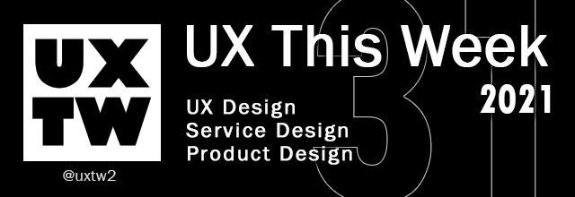

# UXTW - Week 31, 2021

## Articles of the week

\*\*\*\*[**8 strategies to help your UX portfolio stand out from the crowd**  
](https://bootcamp.uxdesign.cc/8-strategies-to-help-your-ux-portfolio-stand-out-from-the-crowd-20fa1a59e102/?ref=uxthisweek)Creating a strong portfolio is a worthwhile investment and a definite foot in the door to your next UX role. Your portfolio is one of the most important design projects you will ever work on.

\*\*\*\*[**10 Simple Tips to Improve User Testing**  
](https://uxplanet.org/10-simple-tips-to-improve-user-testing-6a86c84e2794/?ref=uxthisweek) Regular user feedback should be at the heart of _UX design_ process.

\*\*\*\*[**A process for solving workflow design problems**  
](https://ux.shopify.com/a-process-for-solving-workflow-design-problems-cdd1187a3d83/?ref=uxthisweek) More importantly, the feature was difficult to find. This led to some users assuming that changing their email address would also transfer the store ownership.

\*\*\*\*[**Product Discovery Playbook**  
](https://productcoalition.com/product-discovery-playbook-a579bbe3e572/?ref=uxthisweek)Product Discovery is an exercise in working out whether there are customers that want the product \(or feature\) you’re working on and that you can deliver a solution to them.

\*\*\*\*[**Data Is More than Numbers: Why Qualitative Data Isn’t Just Opinions**  
](https://www.nngroup.com/articles/qualitative-rigor/?ref=uxthisweek)Systematically gathered qualitative data is a dependable method of understanding what users need, why problems occur, and how to solve them.


Join us on Social Platforms.   
[**Twitter**](https://twitter.com/uxtw2) **\|** [**Facebook**](https://www.facebook.com/webusabilityandux) **\|** [**Linkedin**](https://www.linkedin.com/groups/1875717/) **\|** [**Slack**](https://join.slack.com/t/uxthisweek/shared_invite/zt-szpdweo1-d78hso8FppFcI68Xue_9Yw) **\| Newsletter**


## Products of the week

\*\*\*\*[**UXflow**](https://products.ls.graphics/uxflow/?ref=uxthisweek)  
UX Flow Wireframe Prototyping System is a huge library of mobile and web flowcharts for Sketch. According to our opinion, we selected the most necessary categories and made 450+ flowcharts for planning your projects easier and faster.

\*\*\*\*[**UXTesting**](https://www.uxtesting.io/?ref=uxthisweek) ****  
The best User Experience partner trusted by designers and researchers for efficiency, cost-effectiveness and demonstrate the profession.

\*\*\*\*[**NeverInstall**](https://neverinstall.com/?ref=uxthisweek)  
A powerful platform for accessing desktop applications through the browser. Say goodbye to slow and laggy machines.


Join us on Social Platforms.  
[**Twitter**](https://twitter.com/uxtw2) **\|** [**Facebook**](https://www.facebook.com/webusabilityandux) **\|** [**Linkedin**](https://www.linkedin.com/groups/1875717/) **\|** [**Slack**](https://join.slack.com/t/uxthisweek/shared_invite/zt-szpdweo1-d78hso8FppFcI68Xue_9Yw) **\|** [**Newsletter**](https://gmail.us17.list-manage.com/subscribe?u=1b23fd286b43ac36e4acba123&id=0009036f95)


