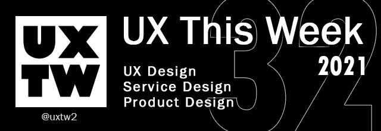

# UXTW - Week 32, 2021

## Articles of the week

****[**When Critical Thinking goes wrong**](https://blog.prototypr.io/when-critical-thinking-goes-wrong-c14686e3d4ab?ref=uxthisweek)****[****\
****](https://bootcamp.uxdesign.cc/8-strategies-to-help-your-ux-portfolio-stand-out-from-the-crowd-20fa1a59e102/?ref=uxthisweek)Meditation is not stopping thinking. Only until you die do your thinking stop. Meditation is about training the mind to be laid-back, stay restful, and gently pull itself back whenever it wanders.” — Ph.D. Neal Newfield.

****[**Six exercises to overcome skill plateaus as a designer**](https://uxdesign.cc/how-to-break-out-of-your-plateau-as-a-designer-7cb762d1039f?ref=uxthisweek)****[****\
****](https://uxplanet.org/10-simple-tips-to-improve-user-testing-6a86c84e2794/?ref=uxthisweek)Throughout my design career, I’ve experienced phases of plateaus and growth. Here are a few design exercises I came up with that helped me break out of those plateaus.

****[**What the Fog**](https://design.google/library/what-the-fog/?ref=uxthisweek)\
Disequilibrium often sets in at critical shifts in our lives and careers. I felt it for the first time when I switched from being an architect to being an “experience designer” at IDEO..

****[**Closing the Experience Gap**](https://airbnb.design/closing-the-experience-gap/?ref=uxthisweek)****[****\
****](https://productcoalition.com/product-discovery-playbook-a579bbe3e572/?ref=uxthisweek)Many product teams fail to recognize that the “average user” use cases do not apply to everyone, and continuing to only prioritize this segment will create larger experience gaps on the platform.

****[**2021 Scroll Survey Report**](https://web.dev/2021-scroll-survey-report/?ref=uxthisweek)****[****\
****](https://www.nngroup.com/articles/qualitative-rigor/?ref=uxthisweek)2021 Scroll Survey Report plus words from the Chrome team about how this impacts priorities and plans for Chromium and the web.


Join us on Social Platforms. \
[**Twitter**](https://twitter.com/uxtw2) **|** [**Facebook**](https://www.facebook.com/webusabilityandux) **|** [**Linkedin**](https://www.linkedin.com/groups/1875717/) **|** [**Slack**](https://join.slack.com/t/uxthisweek/shared\_invite/zt-szpdweo1-d78hso8FppFcI68Xue\_9Yw) **| Newsletter**


## Products of the week

****[**Hexometer**](https://hexometer.com/?ref=uxthisweek)\
The Hexometer (HX) algorithm assigns each website a numeric value. That value is a particular website’s HX Rank calculated by a proprietary formula using public data about the domain name, the website's technical parameters and structure.

****[**bravostudio**](https://www.bravostudio.app/?ref=uxthisweek)\
From Figma to iOS & Android app. Turn your prototypes into fully native apps instantly. No code

****[**relate.app**](https://relate.app/?ref=uxthisweek)\
Design real products on the native web with your team.


Join us on Social Platforms.\
[**Twitter**](https://twitter.com/uxtw2) **|** [**Facebook**](https://www.facebook.com/webusabilityandux) **|** [**Linkedin**](https://www.linkedin.com/groups/1875717/) **|** [**Slack**](https://join.slack.com/t/uxthisweek/shared\_invite/zt-szpdweo1-d78hso8FppFcI68Xue\_9Yw) **|** [**Newsletter**](https://gmail.us17.list-manage.com/subscribe?u=1b23fd286b43ac36e4acba123\&id=0009036f95)

