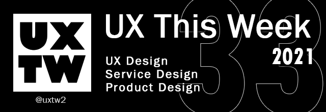

# UXTW - Week 33, 2021

## Articles of the week

\*\*\*\*[**A guide to designing accessible, WCAG-compliant focus indicators**](https://www.sarasoueidan.com/blog/focus-indicators/?ref=uxthisweek)\*\*\*\*[  
****](https://bootcamp.uxdesign.cc/8-strategies-to-help-your-ux-portfolio-stand-out-from-the-crowd-20fa1a59e102/?ref=uxthisweek) Unfortunately, keyboard users experience the Web in a similarly frustrating manner too often. Their equivalent of a mouse cursor is usually hidden on too many Web sites, making it almost impossible for them to navigate those sites. A keyboard user’s cursor equivalent is the **focus indicator**.

\*\*\*\*[**Accessible contrast ratios and A-levels explained**](https://www.getstark.co/blog/accessible-contrast-ratios-and-a-levels-explained?ref=uxthisweek)\*\*\*\*[  
****](https://uxplanet.org/10-simple-tips-to-improve-user-testing-6a86c84e2794/?ref=uxthisweek)All about those A's — your guide to understanding and making use of the ratios that determine your accessible contrast.

\*\*\*\*[**UX Principles that include Cognitive Accessibility**](https://www.ab11y.com/articles/ux-principles-that-include-cognitive-accessibility/?ref=uxthisweek)  
Cognitive design as a practice came out of studies in user interaction with consumer products in the 1970s, and by the 80s their use was commonplace in the product design industry. Parts of these principles have transferred into the digital space as “Usability Heuristics” but they have an issue.

\*\*\*\*[**Case Study: Redesigning the website for ‘The Intersectional Feminist’**](https://medium.muz.li/case-study-redesigning-the-website-for-the-intersectional-feminist-8a6c9900e675?ref=uxthisweek)\*\*\*\*[  
****](https://productcoalition.com/product-discovery-playbook-a579bbe3e572/?ref=uxthisweek)This project elaborates on the design decisions taken while redesigning a website for The Intersectional Feminist ****from scratch. The project took about a month and a half to design & develop.

\*\*\*\*[**How Bob Moog brought usability heuristics to the electronic synthesizer**  
](https://uxdesign.cc/how-bob-moog-brought-usability-heuristics-to-the-electronic-synthesizer-a6797a3a9192)Decades prior to the modern-day computer as we know it, Bob Moog used design principles to bring a once niche instrument to the mainstream, influencing generations of musicians and instrument interfaces.


Join us on Social Platforms.   
[**Twitter**](https://twitter.com/uxtw2) **\|** [**Facebook**](https://www.facebook.com/webusabilityandux) **\|** [**Linkedin**](https://www.linkedin.com/groups/1875717/) **\|** [**Slack**](https://join.slack.com/t/uxthisweek/shared_invite/zt-szpdweo1-d78hso8FppFcI68Xue_9Yw) **\| Newsletter**


## Products of the week

\*\*\*\*[**Access Guide**](https://www.notion.so/alexsnotes/d6a894bb4b234af3a5da4d2632338fff?v=465d85d448264d6da49cca67a4b5c442)  
 Access Guide is a friendly introduction to digital accessibility - specifically to help understand [WCAG 2.1](https://www.w3.org/TR/WCAG21/) \(Web Content Accessibility Guidelines\), the official resource for legal compliance.

\*\*\*\*[**Tinter**](https://tinter.uxie.io/?ref=uxthisweek)  
A tiny web tool to generate color variation of images.

\*\*\*\*[**Setups**](https://setups.co/?ref=uxthisweek)  
A repository of workspaces, items & tools from the creator community.


Join us on Social Platforms.  
[**Twitter**](https://twitter.com/uxtw2) **\|** [**Facebook**](https://www.facebook.com/webusabilityandux) **\|** [**Linkedin**](https://www.linkedin.com/groups/1875717/) **\|** [**Slack**](https://join.slack.com/t/uxthisweek/shared_invite/zt-szpdweo1-d78hso8FppFcI68Xue_9Yw) **\|** [**Newsletter**](https://gmail.us17.list-manage.com/subscribe?u=1b23fd286b43ac36e4acba123&id=0009036f95)


