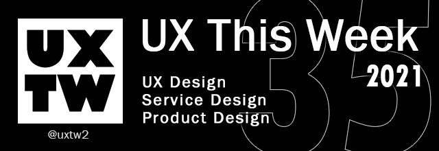

# UXTW -Week 35, 2021

## Articles of the week

****[**Why Product Thinking is the next big thing in UX Design**](https://medium.com/@jaf\_designer/why-product-thinking-is-the-next-big-thing-in-ux-design-ee7de959f3fe/?ref=uxthisweek)****[****\
****](https://airbnb.design/evolving-by-design/?ref=uxthisweek)The core user experience is not a set of features; in fact, it is the job users hire the product for.

****[**The Most Important Rule in UX Design that Everyone Breaks**](https://blog.prototypr.io/the-most-important-rule-in-ux-design-that-everyone-breaks-1c1cb188931)****[****\
****](https://uxplanet.org/10-simple-tips-to-improve-user-testing-6a86c84e2794/?ref=uxthisweek)There is one principle of organization that every human should adhere to, particularly people who design products. Day after day, I see companies break this rule, and it is 100% of the time to their detriment.

****[**How to develop an Innovator’s Mindset in the established Enterprise**](https://medium.com/@jaf\_designer/how-to-develop-an-innovators-mindset-in-the-established-enterprise-90ec685c7aa1)\
In a corporate environment that values perfect execution over free exploration, every innovation activity becomes incredibly hard: how to challenge the status quo in an organisational structure that has been built to protect it?

[**Wireframes by Top UX Designers**](https://medium.com/inspiration-supply/wireframes-by-top-ux-designers-d6922d34ddb8)****[****\
****](https://productcoalition.com/product-discovery-playbook-a579bbe3e572/?ref=uxthisweek)Wireframes are important for multiple reasons. One of them would be that they, the wireframes, focus on functionality, behavior, and priority of content. Once you have those things established, designing the product becomes a lot easier.

****[**Most Common UX Design Methods and Techniques**](https://uxplanet.org/most-common-ux-design-methods-and-techniques-c9a9fdc25a1e)****[****\
****](https://uxdesign.cc/how-bob-moog-brought-usability-heuristics-to-the-electronic-synthesizer-a6797a3a9192)A statement that maps out the key aspects of product: what it is, who it is for and how it will be used. Value proposition helps the team create consensus around what the product will be.


Join us on Social Platforms. \
[**Twitter**](https://twitter.com/uxtw2)** | **[**Facebook**](https://www.facebook.com/webusabilityandux)** | **[**Linkedin**](https://www.linkedin.com/groups/1875717/)** | **[**Slack**](https://join.slack.com/t/uxthisweek/shared\_invite/zt-szpdweo1-d78hso8FppFcI68Xue\_9Yw)** | Newsletter**


## Products of the week

****[**wepresent.wetransfer.com**](https://wepresent.wetransfer.com)\
Unexpected stories about creativity.

[**pixelied**](https://pixelied.com)\
A full suite of image editing tools, with standalone solutions for the most common uses, tailored for businesses.

****[**sessions.us**](https://sessions.us/?ref=uxthisweek)\
Sessions is redefining hybrid communication by bringing all your collaboration tools in one single place. With our unique agenda designer, all your sessions will be flawlessly organized and always on time&#x20;


Join us on Social Platforms.\
[**Twitter**](https://twitter.com/uxtw2)** | **[**Facebook**](https://www.facebook.com/webusabilityandux)** | **[**Linkedin**](https://www.linkedin.com/groups/1875717/)** | **[**Slack**](https://join.slack.com/t/uxthisweek/shared\_invite/zt-szpdweo1-d78hso8FppFcI68Xue\_9Yw)** | **[**Newsletter**](https://gmail.us17.list-manage.com/subscribe?u=1b23fd286b43ac36e4acba123\&id=0009036f95)

