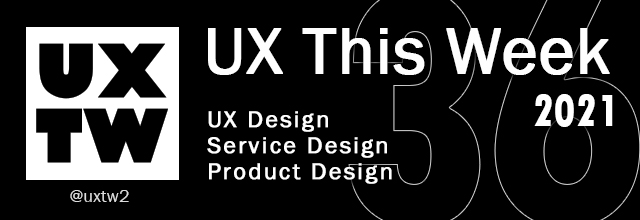

# UXTW - Week 36, 2021

## Articles of the week

\*\*\*\*[**The Psychology of User Offboarding**](https://growth.design/case-studies/adobe-cancel-subscription/?ref=uxthisweek)\*\*\*\*[  
****](https://airbnb.design/evolving-by-design/?ref=uxthisweek)Discover the user offboarding tactics used by Adobe, and how to design a subscription cancellation flow without relying on unethical dark patterns.

\*\*\*\*[**Tesla’s new ‘mind of car’ UI signals a future**](https://uxdesign.cc/teslas-new-mind-of-car-ui-signals-a-future-we-re-not-prepared-for-c38a6212c32)\*\*\*\*[  
****](https://uxplanet.org/10-simple-tips-to-improve-user-testing-6a86c84e2794/?ref=uxthisweek)The ‘Mind of a car’ is an enhanced visualization of what the AI sees and thinks through its vision-only cameras on a Tesla with FSD installed.

\*\*\*\*[**Efficient multi-product design systems**](https://www.invisionapp.com/talks/design-systems-with-bmo-june-2021?utm_source=blog&utm_medium=organic&utm_campaign=BMO_Financial_InVision_Talk)  
BMO’s growth story, including how they built a design system from the ground up to power a growing network of subsystems that connect its distributed teams.

\*\*\*\*[**What Is ResearchOps and Why Is This Role So Useful**](https://www.uxpin.com/studio/blog/what-is-researchops/)\*\*\*\*[  
****](https://productcoalition.com/product-discovery-playbook-a579bbe3e572/?ref=uxthisweek)ResearchOps is the people, mechanisms, and strategies that set user research in motion. It provides the roles, tools, and processes needed to support researchers in delivering and scaling the impact of the craft across an organization.

\*\*\*\*[**Requirements: how to add depth to your UX practice using business analysis**](https://bootcamp.uxdesign.cc/requirements-how-to-add-depth-to-your-ux-practice-using-business-analysis-93fe8c6fe8c4)\*\*\*\*[  
****](https://uxdesign.cc/how-bob-moog-brought-usability-heuristics-to-the-electronic-synthesizer-a6797a3a9192)Business requirements are the organization's goals & objectives for a given product/project/initiative. It comes down to what the organization wants to achieve for its customers \(which could be internal, or external to the organization\).


Join us on Social Platforms.   
[**Twitter**](https://twitter.com/uxtw2) **\|** [**Facebook**](https://www.facebook.com/webusabilityandux) **\|** [**Linkedin**](https://www.linkedin.com/groups/1875717/) **\|** [**Slack**](https://join.slack.com/t/uxthisweek/shared_invite/zt-szpdweo1-d78hso8FppFcI68Xue_9Yw) **\| Newsletter**


## Products of the week

\*\*\*\*[**UI & UX Tips**](https://www.uidesign.tips/ux-tips?ref=uxthisweek)  
Learn how to boost conversions and make your users happier with these simple UX tips from real-life products.

\*\*\*\*[**Slantt**](https://slantt.co/?ref=uxthisweek)  
Create stunning isometric graphics in minutes.

\*\*\*\*[**Heydesign**](https://heydesign.systems/?ref=uxthisweek)  
 A space dedicated for all things Design Systems, curated by [@saura3h](https://twitter.com/saura3h) 

