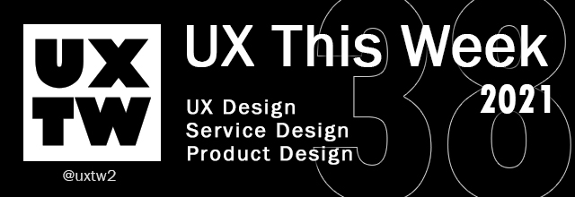

# UXTW -Week 38, 2021

## Articles of the week

****[**The Infamous Case of the "Mute" Button**](https://www.nngroup.com/articles/state-switch-buttons/?ref=uxthisweek)****[****\
****](https://airbnb.design/evolving-by-design/?ref=uxthisweek)On–off controls that switch between two different system states need to clearly communicate to users both the current state and the state the system will move to, should the user press that control.

****[**Brainwashed by design**](https://uxdesign.cc/brainwashed-by-design-65743195280)****[****\
****](https://uxplanet.org/10-simple-tips-to-improve-user-testing-6a86c84e2794/?ref=uxthisweek)By providing us with options or opportunities for a better experience, design sometimes makes us feel we are no longer living our best lives.

****[**UX Project Checklist**](https://medium.com/uxchecklist/ux-project-checklist-why-i-made-it-and-whats-next-6df312b0b92e)\
Goal was just to get our team to **\*think\*** about each step, the actions following was for us to decide

****[**UX Research Guide**](https://www.instagram.com/anfisign/guide/research-guide/17860279889266404/)****[****\
****](https://productcoalition.com/product-discovery-playbook-a579bbe3e572/?ref=uxthisweek)Here is a complete guide that will take you step by step and will explain you how do you do every most common UX activity

****[**The UX in Motion Manifesto**](https://medium.com/ux-in-motion/creating-usability-with-motion-the-ux-in-motion-manifesto-a87a4584ddc)****[****\
****](https://uxdesign.cc/how-bob-moog-brought-usability-heuristics-to-the-electronic-synthesizer-a6797a3a9192)As a UX or UI, designer, how do I know when and where to implement motion to support usability?


Join us on Social Platforms. \
[**Twitter**](https://twitter.com/uxtw2)** | **[**Facebook**](https://www.facebook.com/webusabilityandux)** | **[**Linkedin**](https://www.linkedin.com/groups/1875717/)** | **[**Slack**](https://join.slack.com/t/uxthisweek/shared\_invite/zt-szpdweo1-d78hso8FppFcI68Xue\_9Yw)** | Newsletter**


## Products of the week

****[**onboardingshuffle**](https://app.onboardingshuffle.space/?ref=uxthisweek)\
Generate onboarding mockups and flow  inspiration.

****[**mechanic**](https://mechanic.design/?ref=uxthisweek)\
Turn your design rules into design tools.

****[**doodleipsum**](https://doodleipsum.com/?ref=uxthisweek)\
The lorem ipsum of illustrations. Just customize your doodles, grab the code, and use them on your web prototypes, landing pages, or no-code tools.&#x20;


Join us on Social Platforms.\
[**Twitter**](https://twitter.com/uxtw2)** | **[**Facebook**](https://www.facebook.com/webusabilityandux)** | **[**Linkedin**](https://www.linkedin.com/groups/1875717/)** | **[**Slack**](https://join.slack.com/t/uxthisweek/shared\_invite/zt-szpdweo1-d78hso8FppFcI68Xue\_9Yw)** | **[**Newsletter**](https://gmail.us17.list-manage.com/subscribe?u=1b23fd286b43ac36e4acba123\&id=0009036f95)

