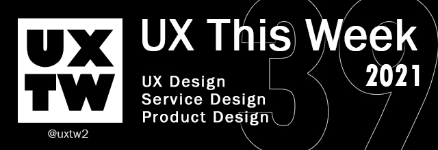

# UXTW - Week 39, 2021

## Articles of the week

\*\*\*\*[**Globalizing Your UX Designs**](https://indeed.design/article/globalizing-your-ux-designs?ref=uxthisweek)\*\*\*\*[  
****](https://airbnb.design/evolving-by-design/?ref=uxthisweek)Delivering a seamless user experience to a global audience requires an understanding of how different markets access, consume, and interpret products and information.

\*\*\*\*[**Digital products are having their “assembly line” moment—here’s how to stay relevant**](https://www.invisionapp.com/inside-design/design-systems-revolution-how-to-adapt/?ref=uxthisweek)\*\*\*\*[  
****](https://uxplanet.org/10-simple-tips-to-improve-user-testing-6a86c84e2794/?ref=uxthisweek)Each UI is essentially “hand-crafted”, with designers trying to improve specific aspects without a clearly-defined scope \(usually caused by silos between design and product teams\) and undocumented institutional knowledge from designers who built related UIs previously. Every new UI or update is an inconsistent offshoot of what’s come before.

\*\*\*\*[**App Bar UI design tips**](https://setproduct.com/blog/appbar-ui-design/?ref=uxthisweek)  
The exploration for Application Bar component: Anatomy, Themes, Styling, Use cases, Templates and Inspiration

\*\*\*\*[**A guide to design tokens**](https://www.invisionapp.com/inside-design/design-tokens/)\*\*\*\*[  
****](https://productcoalition.com/product-discovery-playbook-a579bbe3e572/?ref=uxthisweek) [Design tokens](https://support.invisionapp.com/hc/en-us/articles/360049950931) are here to bring you closer to perfection, allowing you to manage all of your common properties from a single source and then distribute them to all of your applications and designs.

\*\*\*\*[**Quicker UX Research Synthesis**](https://uxtools.co/blog/quicker-ux-research-synthesis/?ref=uxthisweek)\*\*\*\*[  
****](https://uxdesign.cc/how-bob-moog-brought-usability-heuristics-to-the-electronic-synthesizer-a6797a3a9192)Cluttered whiteboards and sticky notes are proven ways to process your research, but not the most efficient ways. Instead, consider how you can synthesize your research as you go.


Join us on Social Platforms.   
[**Twitter**](https://twitter.com/uxtw2) **\|** [**Facebook**](https://www.facebook.com/webusabilityandux) **\|** [**Linkedin**](https://www.linkedin.com/groups/1875717/) **\|** [**Slack**](https://join.slack.com/t/uxthisweek/shared_invite/zt-szpdweo1-d78hso8FppFcI68Xue_9Yw) **\| Newsletter**


## Products of the week

\*\*\*\*[**Pluto**](https://www.pluto.app/?ref=uxthisweek)  
With Pluto people can access powerful XR applications, and use them with anyone, no matter of their physical location..

\*\*\*\*[**All Hands**  
](https://nappy.co/all-hands/?ref=uxthiseek)25 photos \(and PSD mockups\) featuring hands of all shades, shapes, and sizes.

\*\*\*\*[**Microcopy**](https://www.microcopy.me/?ref=uxthisweek)  
Short text or microcopy collection for your website. 


Join us on Social Platforms.  
[**Twitter**](https://twitter.com/uxtw2) **\|** [**Facebook**](https://www.facebook.com/webusabilityandux) **\|** [**Linkedin**](https://www.linkedin.com/groups/1875717/) **\|** [**Slack**](https://join.slack.com/t/uxthisweek/shared_invite/zt-szpdweo1-d78hso8FppFcI68Xue_9Yw) **\|** [**Newsletter**](https://gmail.us17.list-manage.com/subscribe?u=1b23fd286b43ac36e4acba123&id=0009036f95)


