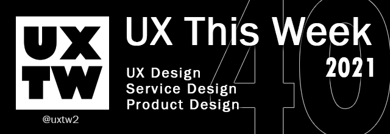

# UXTW - Week 40, 2021

## Articles of the week

[**How to Write a Mission Statement for a UX Team**](https://www.nngroup.com/articles/ux-team-mission-statement/?ref=uxthisweek)\
Create a team mission statement collaboratively with your team. Make sure everybody understands what a mission statement is and abstract the core purpose and value of your team by identifying themes in stories of value about your team.\
\
[**The process of inclusive design**](https://developer.apple.com/videos/play/wwdc2021/10304/)\
Discover how you can deliver inclusive apps that can foster amazing experiences for everyone who uses your software. We'll take you through best practices for creating and empowering diverse teams and explore how inclusivity influences every stage of the design and development process.\
\
[**Talking to users**](https://start.uxdesign.cc/user-research/)\
The importance of user research as a critical tool to ensure the experiences we design are actually delivering on people’s needs.\
\
[**The UX lone wolf: Are we really alone?**](https://bootcamp.uxdesign.cc/the-ux-lone-wolf-are-we-really-alone-a55c96186e92)\
Being the only UX designer in an organization can be a daunting and frustrating task. Because, well, you’re alone. But are you?\
\
[**Glassmorphism in 2021**](https://michalmalewicz.medium.com/glassmorphism-in-2021-b6a8e3e8f509)\
From acrylic, through frosted-glass to simply “glass effect”. Without a common name designers could agree on, there would be difficulty exploring the use-cases, inspirations and examples.


Join us on Social Platforms. \
[**Twitter**](https://twitter.com/uxtw2) **|** [**Facebook**](https://www.facebook.com/webusabilityandux) **|** [**Linkedin**](https://www.linkedin.com/groups/1875717/) **|** [**Slack**](https://join.slack.com/t/uxthisweek/shared\_invite/zt-szpdweo1-d78hso8FppFcI68Xue\_9Yw) **| Newsletter**


## Products of the week

[**Quest**](https://www.quest.ai/ref=uxthisweek)\
**Convert your designs into React apps or HTML pages instantly.**

**‌**\
[**Strings**](https://www.strings.design/?ref=uxthisweek)\
**Take charge of your UX copy from design to code.**

\
[**Gestures**](https://www.semplice.com/gestures?ref=uxthisweek)\
**A collection of ethereal hand motions for your real-world designs. Use them for UX/UI demonstrations or prototypes.**


Join us on Social Platforms.\
[**Twitter**](https://twitter.com/uxtw2) **|** [**Facebook**](https://www.facebook.com/webusabilityandux) **|** [**Linkedin**](https://www.linkedin.com/groups/1875717/) **|** [**Slack**](https://join.slack.com/t/uxthisweek/shared\_invite/zt-szpdweo1-d78hso8FppFcI68Xue\_9Yw) **|** [**Newsletter**](https://gmail.us17.list-manage.com/subscribe?u=1b23fd286b43ac36e4acba123\&id=0009036f95)

