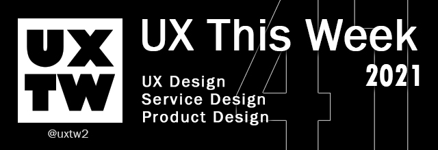

# UXTW - Week 41, 2021

## Articles of the week

[**The 5 Pillars Of Good Design Leadership**](https://uxstudioteam.com/ux-blog/design-leadership/)\
What does leadership entail in the context of design? What does a lead product designer have to concentrate on in order to be a good design leader? How does an organization benefit from strong design leadership?.\
\
[**What is Design Management?**](https://cdn.ymaws.com/www.dmi.org/resource/resmgr/pdf\_files/Lucerne\_School\_of\_Art\_&\_Desi.pdf)\
Design management is instrumental in developing appropriate processes and methods that can integrate design into the core competency of a business. Design managers coordinate the activities of various stakeholders (designers, managers, product developers, marketing and corporate communication staff, external suppliers, etc.) with a view to enabling the organisation to reach its goals as effectively as possible.\
\
[**8 critical skills of effective design leaders**](https://www.abstract.com/blog/design-leadership-skills)\
In an increasingly collaborative design world, hard and fast rules don't necessarily apply. But traits like emotional intelligence, future-obsession, and ability to trust rise to the top.\
\
[**Introducing UX to an organisation from scratch**](https://uxdesign.cc/introducing-user-experience-design-to-an-organisation-from-scratch-955a89ab80cb)\
So you have just landed on a project and you are tasked with introducing the client to User Experience Design (UXD) and building a design system from scratch, you have autonomy on what needs to be done and have been brought in to help shape the vision for the project with your client. Sounds like a designer’s dream right?\
\
[**Giving a damn about accessibility**](https://uxdesign.cc/giving-a-damn-about-accessibility-6caf90be5a40)\
Digital accessibility is the inclusive practice of ensuring that everyone has equal access to information, functionality, and experience on digital platforms. That means no barriers prevent interaction with, or access to, digital products by people with any type of disabilities or traits commonly linked to disabilities.


Join us on Social Platforms. \
[**Twitter**](https://twitter.com/uxtw2)** | **[**Facebook**](https://www.facebook.com/webusabilityandux)** | **[**Linkedin**](https://www.linkedin.com/groups/1875717/)** | **[**Slack**](https://join.slack.com/t/uxthisweek/shared\_invite/zt-szpdweo1-d78hso8FppFcI68Xue\_9Yw)** | Newsletter**


## Products of the week

[**Focus**](https://designwithfocus.com)\
**A collaboration platform for designers, developers and product teams, directly within Adobe XD.**

**‌**\
[**Super**](https://super.so/builder?ref=uxthisweek)\
**Create beautiful landing pages directly in Notion. Drag & drop components, apply custom themes, and get up and running in minutes.**

**‌**\
[**Productmanifesto**](https://www.productmanifesto.com/?ref=uxthisweek)\
**Up-to-date values and principles for Product People today.**


Join us on Social Platforms.\
[**Twitter**](https://twitter.com/uxtw2)** | **[**Facebook**](https://www.facebook.com/webusabilityandux)** | **[**Linkedin**](https://www.linkedin.com/groups/1875717/)** | **[**Slack**](https://join.slack.com/t/uxthisweek/shared\_invite/zt-szpdweo1-d78hso8FppFcI68Xue\_9Yw)** | **[**Newsletter**](https://gmail.us17.list-manage.com/subscribe?u=1b23fd286b43ac36e4acba123\&id=0009036f95)

