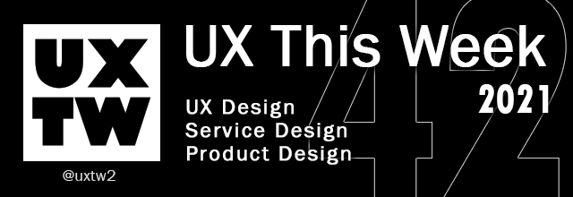

# UXTW - Week 42, 2021

## UXThisWeek - Issue #42 October, 2021

## Articles of the week

****[**UXE: What Is a UX Engineer?**](https://blog.devmountain.com/uxe-what-is-a-ux-engineer/)****[****\
****](https://airbnb.design/evolving-by-design/?ref=uxthisweek)Ultimate Xylophone engineer? That’s what you mean when you say UX engineer (UXE), right? We’re kidding, of course. A xylophone is not the first thing _anyone_ thinks of when they hear _UX engineer_. But what exactly _is_ the first thing? What is a UX engineer?&#x20;

****[**Switching Careers to UX**](https://uxtools.co/guides/switching-careers-to-ux/)****[****\
****](https://uxplanet.org/10-simple-tips-to-improve-user-testing-6a86c84e2794/?ref=uxthisweek)The decision sure didn’t come easy. I put in a ton of hours to make sure it was going to be a worthwhile career change. I look forward to where this career will take me!.

****[**Architect to UX designer**](https://bootcamp.uxdesign.cc/my-transition-from-architecture-to-ux-design-519fd28385fe)\
A global taxi company with no taxis. A giant shopping mall with no buildings. A worldwide hospitality company with no hotels. Why not create an architecture firm with no architects or interior designers?

[Understanding Cognitive Bias in Product Design, the Good and Bad](https://www.toptal.com/designers/ux/cognitive-bias-product-design)[****\
****](https://productcoalition.com/product-discovery-playbook-a579bbe3e572/?ref=uxthisweek)Knowing the psychology of how and why we make certain decisions can help in creating more user-centric sites and apps.

****[**Researchers: how to automatically pull reviews from AppStore and Google Play**](https://uxdesign.cc/how-do-i-automate-getting-reviews-from-appstore-and-google-play-4cc0ebf1a6e4)****[****\
****](https://uxdesign.cc/how-bob-moog-brought-usability-heuristics-to-the-electronic-synthesizer-a6797a3a9192)One of the excellent ways to get feedback on developing products is to read the reviews from real people. It’s smooth when you are creating a mobile app. You can go to [**App Store**](https://www.apple.com/app-store/) or [**Google Play**](https://play.google.com) and dive into raw data.


Join us on Social Platforms. \
[**Twitter**](https://twitter.com/uxtw2)** | **[**Facebook**](https://www.facebook.com/webusabilityandux)** | **[**Linkedin**](https://www.linkedin.com/groups/1875717/)** | **[**Slack**](https://join.slack.com/t/uxthisweek/shared\_invite/zt-szpdweo1-d78hso8FppFcI68Xue\_9Yw)** | Newsletter**


## Products of the week

[Userforge](https://userforge.com/?ref=uxthisweek)\
Persona generator and [user story template](https://userforge.com/user-stories.html) tools to **align your efforts with real-world user needs.**

[**M**indnote](https://www.mindnode.com/?ref=uxthisweek)[****\
****](https://productcoalition.com/product-discovery-playbook-a579bbe3e572/?ref=uxthisweek)Start planning your vacation. Outlining your next best-seller. Writing your notes. MindNode lets you capture, organize, style and share your thoughts.

****[**Ribbon**](https://www.ribbonapp.com/?ref=uxthisweek)****[****\
****](https://uxdesign.cc/how-bob-moog-brought-usability-heuristics-to-the-electronic-synthesizer-a6797a3a9192)Ribbon helps product researchers gather feedback and interview users at speed, without the hassle.


Join us on Social Platforms.\
[**Twitter**](https://twitter.com/uxtw2)** | **[**Facebook**](https://www.facebook.com/webusabilityandux)** | **[**Linkedin**](https://www.linkedin.com/groups/1875717/)** | **[**Slack**](https://join.slack.com/t/uxthisweek/shared\_invite/zt-szpdweo1-d78hso8FppFcI68Xue\_9Yw)** | **[**Newsletter**](https://gmail.us17.list-manage.com/subscribe?u=1b23fd286b43ac36e4acba123\&id=0009036f95)

