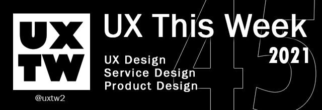

# UXTW - Week 45, 2021

## UXThisWeek - Issue #45 November, 2021

## Articles of the week

****[**6 Career Paths to Consider in Enterprise Design**](https://medium.com/sap-design/6-career-paths-to-consider-in-enterprise-design-710d25712e11)****[****\
****](https://airbnb.design/evolving-by-design/?ref=uxthisweek)The average person will spend one third of their life at work. That’s around 90,000 hours that we can spend doing our jobs well, or waste getting angry at our devices. Luckily there are people out there whose sole occupation is to improve our relationship with the technology we work with. They are called enterprise designers.

****[**The Right Language Can Build Customer Trust, Confidence, and Connection**](https://www.inc.com/vasco-pedro/the-right-language-can-build-customer-trust-confidence-connection.html)****[****\
****](https://uxplanet.org/10-simple-tips-to-improve-user-testing-6a86c84e2794/?ref=uxthisweek)According to Unbabel's Global Multilingual CX Report published last week, one in four U.S. consumers said they won't spend more than $500 with a business if it doesn't offer proper language support.

****[**Hybrid work isn’t perfect, but SCIENCE can help us improve it**](https://thenextweb.com/news/hybrid-work-not-perfect-science-success-syndication)\
99% of human resources leaders expect employees to work in some kind of hybrid arrangement moving forward. Many have already begun. As just one example, Dropbox, the file hosting service, made a permanent shift during the pandemic, allowing employees to work from home and hold team meetings in the office.

[Product Lifecycle & Post Launch Experiences](https://uxplanet.org/product-lifecycle-post-launch-experiences-45d378931fa9)[****\
****](https://productcoalition.com/product-discovery-playbook-a579bbe3e572/?ref=uxthisweek)Product Journeys and crafting market ready applications and software, is a topic that is and hopefully will continue to be, target of many fruitful discussions. One of the topics that I’ve engaged with peers from different groups, including Design, Product and Development, concerns the lifecycle of products, and the the experiences that actually occur when a product solution is unleashed to market

****[**Maintaining the Flow with UX design**](https://medium.com/@jlester\_50163/maintaining-the-flow-with-ux-design-7a35f1390849)****[****\
****](https://uxdesign.cc/how-bob-moog-brought-usability-heuristics-to-the-electronic-synthesizer-a6797a3a9192)The use of design sprints were a revelation and ‘Sprint’ soon became my go to bible. Thank you, Jake Knapp! The sprints guided design solutions, mapping and planning resulted in a solution for a prototype in just four days.


Join us on Social Platforms. \
[**Twitter**](https://twitter.com/uxtw2)** | **[**Facebook**](https://www.facebook.com/webusabilityandux)** | **[**Linkedin**](https://www.linkedin.com/groups/1875717/)** | **[**Slack**](https://join.slack.com/t/uxthisweek/shared\_invite/zt-szpdweo1-d78hso8FppFcI68Xue\_9Yw)** | Newsletter**


## Products of the week

****[**Airgram**](https://www.airgram.io/?ref=uxthisweek)\
The most flexible meeting productivity tool for the hybrid work era. Empower teams to have meetings in the most engaging, efficient, and enjoyable way possible.

****[**Automa**](https://chrome.google.com/webstore/detail/automa/infppggnoaenmfagbfknfkancpbljcca?ref=uxthisweek)****[****\
****](https://productcoalition.com/product-discovery-playbook-a579bbe3e572/?ref=uxthisweek)From auto-fill forms, doing a repetitive task, taking a screenshot, to scraping data of the website, it's up to you what you want to do with this extension. And you also can schedule when the automation will execute.

****[**Microsoft Loop**](https://www.microsoft.com/en-us/microsoft-loop?ref=uxthisweek)****[****\
****](https://uxdesign.cc/how-bob-moog-brought-usability-heuristics-to-the-electronic-synthesizer-a6797a3a9192)Microsoft Loop is a new app that combines a powerful and flexible canvas with portable components that move freely and stay in sync across applications.


Join us on Social Platforms.\
[**Twitter**](https://twitter.com/uxtw2)** | **[**Facebook**](https://www.facebook.com/webusabilityandux)** | **[**Linkedin**](https://www.linkedin.com/groups/1875717/)** | **[**Slack**](https://join.slack.com/t/uxthisweek/shared\_invite/zt-szpdweo1-d78hso8FppFcI68Xue\_9Yw)** | **[**Newsletter**](https://gmail.us17.list-manage.com/subscribe?u=1b23fd286b43ac36e4acba123\&id=0009036f95)

