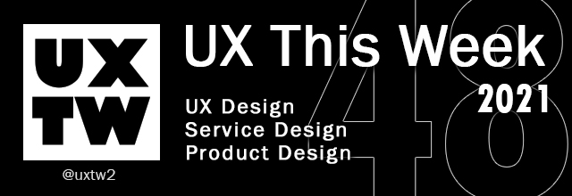

# UXTW -Week 48, 2021

## Articles of the week

****

****[**10 Rules of Thumb for UI/UX Design**](https://uxplanet.org/rules-of-thumb-for-ui-ux-design-4d7a053d781)****[****\
****](https://airbnb.design/evolving-by-design/?ref=uxthisweek)Only by knowing what the current system status is can you change it — that is, you can figure out what you need to do next in order to reach your goal.

****[**Is radical product thinking the future of product design?**](https://uxdesign.cc/is-radical-product-thinking-the-future-of-product-design-bfdb083827e9)****[****\
****](https://uxplanet.org/10-simple-tips-to-improve-user-testing-6a86c84e2794/?ref=uxthisweek)Unfortunately, when we’re iteration-led, i.e. when our iterations are not driven by a clear vision and strategy, our products become bloated, fragmented, and driven by irrelevant metrics.

[**A11y - Super-vision for those who need it**](https://medium.com/@dukauwa.du/a11y-super-vision-for-those-who-need-it-8aa5f3292945)\
A11y has 3 base modes that provide solutions to some basic problems faced by Theresa. These include the **general, text scanner, and assistant modes**.

[**Design Principles and Tactics: Why You Need Both**](https://arturoriosme.medium.com/design-principles-and-tactics-why-you-need-both-49aa28e5d659)****[****\
****](https://productcoalition.com/product-discovery-playbook-a579bbe3e572/?ref=uxthisweek)But Rams did not produce the 10 principles in a vacuum. They were the outcome of more than 40 years of trial and error. Dozens of launched products that forged his expertise as a designer.

[**A Mobile-first Design Approach for SaaS**](https://divamithoughts.medium.com/a-mobile-first-design-approach-for-saas-336f1c1aa037)****[****\
****](https://uxdesign.cc/how-bob-moog-brought-usability-heuristics-to-the-electronic-synthesizer-a6797a3a9192)With the mobile-first design approach gaining traction, it would be prudent to point out that the future of mobile SaaS is app-driven.


Join us on Social Platforms. \
[**Twitter**](https://twitter.com/uxtw2) **|** [**Facebook**](https://www.facebook.com/webusabilityandux) **|** [**Linkedin**](https://www.linkedin.com/groups/1875717/) **|** [**Slack**](https://join.slack.com/t/uxthisweek/shared\_invite/zt-szpdweo1-d78hso8FppFcI68Xue\_9Yw) **| Newsletter**


## Products of the week

****[**Heurio**](https://chrome.google.com/webstore/detail/heurio-ux-check-visual-fe/pjdbofhiijhapnmpgilkeammkanglfdj)\
Perfect for UX check, design & development review, heuristic evaluation, user testing and more.

****[**Kosy**](https://www.kosyoffice.com)****[****\
****](https://productcoalition.com/product-discovery-playbook-a579bbe3e572/?ref=uxthisweek)Where remote teams work and hang out. Kosy makes spending time with your remote team fun & productive

****[**Grist**](https://www.getgrist.com)****[****\
****](https://uxdesign.cc/how-bob-moog-brought-usability-heuristics-to-the-electronic-synthesizer-a6797a3a9192)The world deserves a better tool than spreadsheets. Combine the flexibility of a spreadsheet with the robustness of a database to organize your data, your way.


Join us on Social Platforms.\
[**Twitter**](https://twitter.com/uxtw2) **|** [**Facebook**](https://www.facebook.com/webusabilityandux) **|** [**Linkedin**](https://www.linkedin.com/groups/1875717/) **|** [**Slack**](https://join.slack.com/t/uxthisweek/shared\_invite/zt-szpdweo1-d78hso8FppFcI68Xue\_9Yw) **|** [**Newsletter**](https://gmail.us17.list-manage.com/subscribe?u=1b23fd286b43ac36e4acba123\&id=0009036f95)

