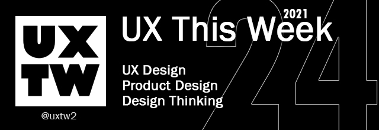

# UX This Week

## Articles of the week

\*\*\*\*[**Archetypes for creative leadership**](https://airbnb.design/archetypes-for-creative-leadership/?ref=uxthisweek)  
“Leadership” is a tricky notion, especially in a business context. Catch your average creative professional in a moment of candor and don’t be surprised if they tell you that “leadership” feels like a vague idea hackneyed by business and self-help books. A term best left in quotes. What’s worse, during performance reviews, we’re asked to quantify leadership—a thing that feels inherently qualitative. It’s a recipe for skepticism and reluctant assent.

\*\*\*\*[**Introduction to design tokens**](https://specifyapp.com/blog/introduction-to-design-tokens/?ref=uxthisweek)  
****This article focuses on the why's and the what's of design tokens. I won't share with you how to create, name, transform or distribute them within your design system.

\*\*\*\*[**Inclusive Design: How to Put Yourself Into One’s Shoes**](https://cadabrastudio.medium.com/inclusive-design-how-to-put-yourself-into-ones-shoes-3e28bc283f16/?ref=uxthisweek)  
Inclusive design is about enabling people with specific impairments to use a particular product in various environments. It teaches designers how to put themselves into different pairs of shoes.

\*\*\*\*[**Reducing Design friction: Why a dev might be the best hire for your design team**](https://medium.com/designing-atlassian/reducing-design-friction-why-a-dev-might-be-your-best-design-team-hire-448e983d3ca9/?ref=uxthisweek)  
Repetition is the antithesis of fun. The games industry has known this for years — grinding out the same thing over and over for the same reward creates diminishing dopamine responses until it becomes aggravating. Conversely, performing an action that amplifies your reward is immensely satisfying.

\*\*\*\*[**A Blueprint for Designing Inclusive AR/VR Experiences**](https://medium.com/facebook-design/a-blueprint-for-designing-inclusive-ar-vr-experiences-6d5c6264dc14/?ref=uxthisweek)  
We’re excited to share this foundational thinking that became helpful in the early process of designing VR apps. You can see some of this thinking in one VR app, Facebook Horizon, and in its comfort and safety features in particular. Here we’ll frame some of our key learnings on how designers might make VR spaces more inclusive.

[**UXTW**](https://gmail.us17.list-manage.com/subscribe?u=1b23fd286b43ac36e4acba123&id=0009036f95)  
Subscribe to _**UX This Week newsletter**_ to get weekly email full of curated articles and products on every thing UX, Product Design and Design thinking.

## Products of the week

**UXTimeline**  
Check how some of today's best companies have evolved.

[**Softr**](https://www.softr.io/?ref=uxthisweek)  
Build web apps & portals from Airtable, no code required.

\*\*\*\*[**Best Design Tool Picker**](https://bestdesignsoftware.io/?ref=uxthisweek)  
There are too many design tools to choose from! Find out which one best fits your needs with this ultimate design tool picker.

[**UXTW**](https://gmail.us17.list-manage.com/subscribe?u=1b23fd286b43ac36e4acba123&id=0009036f95)  
Subscribe to UX This Week newsletter to get weekly email full of curated articles and products on every thing UX, Product Design and Design thinking.

## Portfolio of the week

\*\*\*\*[**Clair Kim**](https://www.clairekim.io/?ref=uxthisweek)  
a marketer-turned-product designer who understands how design can better shape technology and push the business forward. I'm passionate about people and understanding their needs. Previously @IBM, currently designing @Project ANT, incoming UX Designer @Cisco.

\*\*\*\*

