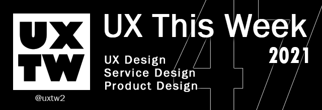

# Week 47, November 2021

## UXThisWeek - Issue #47 November, 2021

## Articles of the week

****

****[**3 Tips for Aspiring UX UI Designers**](https://divamithoughts.medium.com/3-tips-for-aspiring-ux-ui-designers-6b245aa60e1)****[****\
****](https://airbnb.design/evolving-by-design/?ref=uxthisweek)Storytelling: Because you’re only showing a few of your best projects, you’ll need to convey captivating stories about each one. Your portfolio works as a storyteller, taking your audience on a journey of each of your projects and you as a designer.

[Types of design tools for voice user interfaces and how to use them](https://uxdesign.cc/types-of-design-tools-for-voice-user-interfaces-and-how-to-use-them-97172f18228e)[****\
****](https://uxplanet.org/10-simple-tips-to-improve-user-testing-6a86c84e2794/?ref=uxthisweek)If you want to learn how to design a voice interaction for Alexa, Google Assistant, or any other conversational interface, in this article I will go through the different tools you can use in your projects and how to work with each one of them.

****[**Building your dream UX Team**](https://medium.com/@cubyts/building-your-dream-ux-team-b53a8a68c07f)\
Deciding to hire an agency partner or build a user experience team of your own can be challenging; after all, there’s a huge list of pros and cons surrounding either choice. But since smooth and effective UX design is critical to putting together a website that converts, it’s a decision you need to make.

****[**What UX Tools & Techniques Do Apple Use?**](https://medium.com/@shaheermalikofficial/what-ux-tools-techniques-do-apple-use-1c33b5dda565)****[****\
****](https://productcoalition.com/product-discovery-playbook-a579bbe3e572/?ref=uxthisweek)Apple has long been leading the market with its innovative design idea and unique design spirit. There is no one more determined company that does not want to make success as big as Apple.

****[**Dysfunctional systems: Why are we designing for addiction?**](https://uxdesign.cc/dysfunctional-systems-why-are-we-designing-for-addiction-9ce14f6f3879)****[****\
****](https://uxdesign.cc/how-bob-moog-brought-usability-heuristics-to-the-electronic-synthesizer-a6797a3a9192)One of the most popular models of engagement is Nir Eyal’s Hook model, which is usually presented as either an infinity symbol or a downward spiral.


Join us on Social Platforms. \
[**Twitter**](https://twitter.com/uxtw2)** | **[**Facebook**](https://www.facebook.com/webusabilityandux)** | **[**Linkedin**](https://www.linkedin.com/groups/1875717/)** | **[**Slack**](https://join.slack.com/t/uxthisweek/shared\_invite/zt-szpdweo1-d78hso8FppFcI68Xue\_9Yw)** | Newsletter**


## Products of the week

****[**kinopio**](https://kinopio.club)\
A visual thinking tools for hard problems.&#x20;

****[**B**rainio](https://brainio.com)[****\
****](https://productcoalition.com/product-discovery-playbook-a579bbe3e572/?ref=uxthisweek)Note taking and mind mapping combined in one app

****[**Mindnote**](https://www.mindnode.com)****[****\
****](https://uxdesign.cc/how-bob-moog-brought-usability-heuristics-to-the-electronic-synthesizer-a6797a3a9192)Mind mapping on steroids.&#x20;


Join us on Social Platforms.\
[**Twitter**](https://twitter.com/uxtw2)** | **[**Facebook**](https://www.facebook.com/webusabilityandux)** | **[**Linkedin**](https://www.linkedin.com/groups/1875717/)** | **[**Slack**](https://join.slack.com/t/uxthisweek/shared\_invite/zt-szpdweo1-d78hso8FppFcI68Xue\_9Yw)** | **[**Newsletter**](https://gmail.us17.list-manage.com/subscribe?u=1b23fd286b43ac36e4acba123\&id=0009036f95)****


