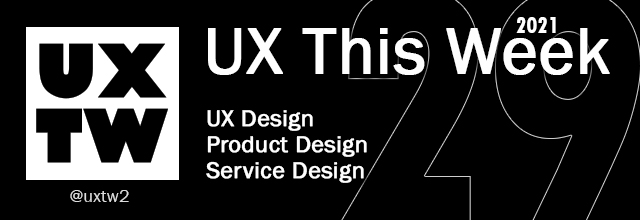

# UX This Week

## UXThisWeek - Issue \#29

## Articles of the week

\*\*\*\*[**Are UI Tips the New Clickbait for Designers?**](https://prototypr.io/post/are-ui-ux-tips-the-new-clickbait-for-designers%E2%9C%A8/?ref=uxthisweek)  
Content whose main purpose is to attract attention and encourage visitors to click on a link to a particular web page.

\*\*\*\*[**Work backwards**](https://jamiemill.com/blog/work-backwards/?ref=uxthisweek)  
**** If you work forwards you anchor your plans to the start rather than end point. You might plan the first few steps clearly then hope to adapt as you go. Or you might take a standard process—[double diamond](https://www.designcouncil.org.uk/news-opinion/double-diamond-universally-accepted-depiction-design-process) or [design sprint](https://www.thesprintbook.com/how)—and see where it takes you.

\*\*\*\*[**Images are hard**](https://css-tricks.com/images-are-hard/?ref=uxthisweek)  
Know enough about image formats off the bat, so that you can use formats like SVG when appropropriate.

\*\*\*\*[**Principle of Closure in Visual Design**](https://www.nngroup.com/articles/principle-closure/?ref=uxthisweek)  
 The **principle of closure** states that people will fill in blanks to perceive a complete object whenever an external stimulus partially matches that object.

\*\*\*\*[**Talks That Shaped My Philosophies**](https://davidhoang.substack.com/p/talks-that-shaped-my-philosophies?ref=uxthisweek)  
Talks that inspired how I approach work as a designer, operator, investor, and entrepreneur.


Join us on Social Platforms.   
[**Twitter**](https://twitter.com/uxtw2) **\|** [**Facebook**](https://www.facebook.com/webusabilityandux) **\|** [**Linkedin**](https://www.linkedin.com/groups/1875717/) **\|** [**Slack**](https://join.slack.com/t/uxthisweek/shared_invite/zt-szpdweo1-d78hso8FppFcI68Xue_9Yw) **\| Newsletter**


## Products of the week

\*\*\*\*[**Cavalri**](https://cavalry.scenegroup.co/?ref=uxthisweek)  
Created by animators, for animators — Cavalry makes 2d animation smarter, easier and faster to produce. Design in real-time for advertising, mobile, data visualisation, web, broadcast, ui, generative art, experiential, games and more.

\*\*\*\*[**Slideflow**](https://www.slideflow.me/?ref=uxthisweek)  
Turn your Google Slides into a website in seconds..

\*\*\*\*[**Product Checklist**](https://www.productchecklist.co/?ref=uxthisweek)  
A collection of best practices for building products —from idea to launch.


Join us on Social Platforms.  
[**Twitter**](https://twitter.com/uxtw2) **\|** [**Facebook**](https://www.facebook.com/webusabilityandux) **\|** [**Linkedin**](https://www.linkedin.com/groups/1875717/) **\|** [**Slack**](https://join.slack.com/t/uxthisweek/shared_invite/zt-szpdweo1-d78hso8FppFcI68Xue_9Yw) **\|** [**Newsletter**](https://gmail.us17.list-manage.com/subscribe?u=1b23fd286b43ac36e4acba123&id=0009036f95)\*\*\*\*


