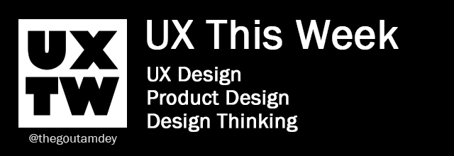

# About UXTW

UXTW - UX This week a newsletter maintains by [_**Goutam Dey**_](https://www.linkedin.com/company/thegoutamdey). He  curates this UX newsletter w\every week for his subscribers. This page is the archive of this weekly newsletter. He also maintains and manages  social group in Linkedin and Facebook platform on User experience (UX) design, Design Thinking and Product Design.&#x20;

If you want to contact him you may write him to  [thegoutamdey@gmail.com](mailto:thegoutamdey@gmail.com). You can follow him on twitter at [_**@uxtw2**_ ](https://twitter.com/uxtw2)or join our Facebook community at [_**https://www.facebook.com/webusabilityandux**_](https://www.facebook.com/webusabilityandux) or join our linkedin group at [_**https://www.linkedin.com/groups/1875717/**_](https://www.linkedin.com/groups/1875717/)_****_\
_****_[_**https://join.slack.com/t/newworkspace-jy07942/shared\_invite/zt-szpdweo1-d78hso8FppFcI68Xue\_9Yw**_](https://join.slack.com/t/newworkspace-jy07942/shared\_invite/zt-szpdweo1-d78hso8FppFcI68Xue\_9Yw)_****_

He also maintains a free UX starting guide at [_**https://thegoutamdey.gitbook.io/ux-design-getting-started-guide/**_](https://thegoutamdey.gitbook.io/ux-design-getting-started-guide/?ref=UXTW)_****_

## :envelope:[Subscribe](https://gmail.us17.list-manage.com/subscribe?u=1b23fd286b43ac36e4acba123\&id=0009036f95) to [UXTW Newsletter](https://gmail.us17.list-manage.com/subscribe?u=1b23fd286b43ac36e4acba123\&id=0009036f95).&#x20;

"No Hurry no Pause" - learning has become a continuous process, and just like your portfolio of shares you need to research stocks to add to your basket you needs to find your education bite as well. I am trying to share my weekly eduction bite to all my subscribers on UX design, Design thinking, Product Design etc.  Sign up for my free weekly newsletter, [**UX This Week**](https://gmail.us17.list-manage.com/subscribe?u=1b23fd286b43ac36e4acba123\&id=0009036f95)**.** Each week you’ll receive five best articles and three digital product which worth a try. This newsletter will help you to going through the best of the week to learn from and help you to move forward in your career with an educated mind and for a  happier future.

## Latest Tweets



